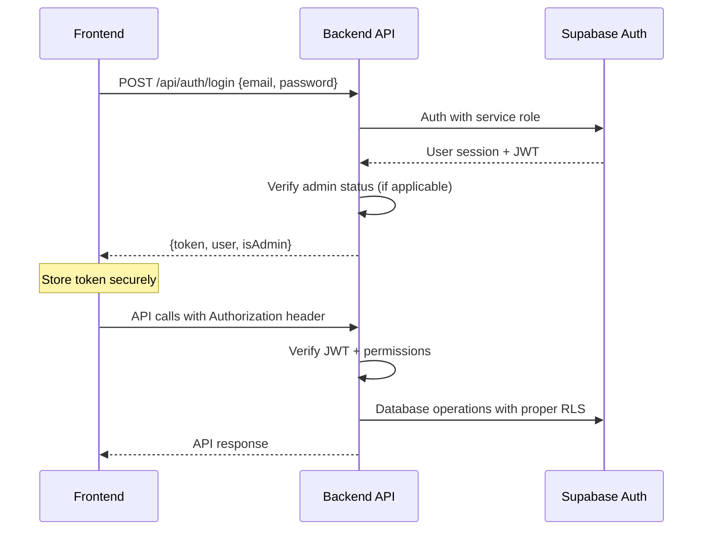

# RUFA ELAN - Target Architecture Documentation

**Generated:** December 5, 2026  
**Focus:** Frontend/Backend separation design, security hardening, scalability improvements

## Architecture Overview

### Target Architecture Vision

The target architecture transforms RUFA ELAN from a monolithic Next.js application into a modern, secure, and scalable separated frontend/backend system while preserving all existing functionality and maintaining backward compatibility.

### Core Principles

1. **Security-First Design:** Address all identified vulnerabilities through proper separation of concerns
2. **Functional Preservation:** Maintain 100% feature parity with current implementation  
3. **Incremental Migration:** Enable gradual transition without service disruption
4. **Scalability Foundation:** Design for future growth and international expansion
5. **Developer Experience:** Improve maintainability and development workflows

### High-Level Architecture

```
┌─────────────────────┐    ┌─────────────────────┐
│   Frontend (Next.js) │    │  Backend (Node.js)   │
│                     │    │                     │
│ ┌─────────────────┐ │    │ ┌─────────────────┐ │
│ │ Customer Portal │ │    │ │   API Gateway   │ │
│ │ - Product Browse│ │◄──►│ │ - Rate Limiting │ │
│ │ - Shopping Cart │ │    │ │ - Authentication│ │
│ │ - Checkout      │ │    │ │ - Authorization │ │
│ │ - Order Track   │ │    │ └─────────────────┘ │
│ └─────────────────┘ │    │                     │
│                     │    │ ┌─────────────────┐ │
│ ┌─────────────────┐ │    │ │ Business Logic  │ │
│ │  Admin Portal   │ │    │ │ - Product Mgmt  │ │
│ │ - Dashboard     │ │◄──►│ │ - Order Mgmt    │ │
│ │ - Product Mgmt  │ │    │ │ - Inventory     │ │
│ │ - Order Mgmt    │ │    │ │ - Analytics     │ │
│ │ - Analytics     │ │    │ └─────────────────┘ │
│ └─────────────────┘ │    │                     │
└─────────────────────┘    └─────────────────────┘
            │                         │
            └────────┬──────────────────┘
                     │
         ┌─────────────────────┐
         │   Shared Services   │
         │                     │
         │ ┌─────────────────┐ │
         │ │ Supabase        │ │
         │ │ - PostgreSQL    │ │
         │ │ - Authentication│ │
         │ │ - Storage       │ │
         │ │ - Real-time     │ │
         │ └─────────────────┘ │
         │                     │
         │ ┌─────────────────┐ │
         │ │ External APIs   │ │
         │ │ - Paystack      │ │
         │ │ - Resend        │ │
         │ │ - Maps API      │ │
         │ └─────────────────┘ │
         └─────────────────────┘
```

## Directory Structure Design

### New Project Structure
```
rufa-elan/
├── frontend/                    # Next.js Frontend Application
│   ├── app/                     # Next.js App Router
│   │   ├── (customer)/          # Customer-facing pages
│   │   │   ├── page.tsx         # Homepage
│   │   │   ├── products/        # Product catalog
│   │   │   ├── cart/            # Shopping cart
│   │   │   ├── checkout/        # Checkout flow
│   │   │   └── account/         # Customer account
│   │   ├── (admin)/             # Admin portal
│   │   │   └── admin/           # Admin dashboard
│   │   └── api/                 # Frontend API proxies only
│   ├── components/              # React components
│   ├── lib/                     # Frontend utilities
│   ├── styles/                  # CSS and styling
│   ├── public/                  # Static assets
│   ├── package.json
│   └── next.config.js
│
├── backend/                     # Node.js Backend API
│   ├── src/
│   │   ├── routes/              # API route handlers
│   │   │   ├── auth/            # Authentication endpoints
│   │   │   ├── products/        # Product management
│   │   │   ├── orders/          # Order processing
│   │   │   ├── admin/           # Admin operations
│   │   │   └── payments/        # Payment processing
│   │   ├── middleware/          # Request middleware
│   │   │   ├── auth.js          # Authentication middleware
│   │   │   ├── admin.js         # Admin authorization
│   │   │   ├── rateLimit.js     # Rate limiting
│   │   │   └── validation.js    # Request validation
│   │   ├── services/            # Business logic services
│   │   │   ├── productService.js
│   │   │   ├── orderService.js
│   │   │   ├── authService.js
│   │   │   └── paymentService.js
│   │   ├── utils/               # Backend utilities
│   │   ├── config/              # Configuration
│   │   └── app.js               # Express app setup
│   ├── tests/                   # API tests
│   ├── package.json
│   └── Dockerfile
│
├── shared/                      # Shared code and types
│   ├── types/                   # TypeScript definitions
│   ├── constants/               # Shared constants
│   ├── utils/                   # Common utilities
│   └── package.json
│
├── database/                    # Database management
│   ├── migrations/              # Schema migrations
│   ├── seeds/                   # Data seeding
│   ├── policies/                # RLS policies
│   └── functions/               # Database functions
│
├── docs/                        # Documentation
└── deployment/                  # Deployment configs
    ├── frontend/                # Frontend deployment
    ├── backend/                 # Backend deployment
    └── docker-compose.yml       # Local development
```
## Frontend Architecture

### Next.js Frontend (Port 3000)

#### Technology Stack
- **Framework:** Next.js 15 with App Router
- **UI Library:** React 18 with TypeScript
- **Styling:** Tailwind CSS + Radix UI components  
- **State Management:** Zustand (client state only)
- **HTTP Client:** Fetch API with custom hooks
- **Authentication:** Supabase Auth client
- **Routing:** Next.js App Router with route groups

#### Frontend Responsibilities
```typescript
// Frontend-only concerns
interface FrontendScope {
  userInterface: {
    componentRendering: true;
    clientStateManagement: true;
    userInteraction: true;
    routingNavigation: true;
    formValidation: "client-side only";
  };
  
  dataAccess: {
    apiCalls: "to backend only";
    caching: "response caching only";
    authentication: "token management only";
    validation: "input sanitization only";
  };
  
  businessLogic: {
    calculationLogic: false;  // Moved to backend
    priceCalculation: false;  // Moved to backend  
    inventoryChecks: false;   // Moved to backend
    orderProcessing: false;   // Moved to backend
  };
}
```

#### Route Group Organization
```
app/
├── (customer)/              # Customer-facing routes
│   ├── page.tsx            # Homepage (/)
│   ├── products/           # Product catalog
│   │   ├── page.tsx        # /products
│   │   └── [slug]/         # /products/[slug]
│   ├── cart/               # Shopping cart (/cart)
│   ├── checkout/           # Checkout flow (/checkout)
│   ├── account/            # Customer account
│   │   ├── page.tsx        # /account
│   │   └── orders/         # /account/orders
│   ├── auth/               # Authentication pages
│   └── support/            # Support pages (about, contact, etc.)
│
├── (admin)/                # Admin-only routes  
│   └── admin/              # Admin dashboard
│       ├── page.tsx        # /admin
│       ├── dashboard/      # /admin/dashboard
│       ├── products/       # /admin/products
│       ├── orders/         # /admin/orders
│       ├── customers/      # /admin/customers
│       └── analytics/      # /admin/analytics
│
├── api/                    # Frontend API routes (proxies only)
│   └── proxy/              # Proxy to backend APIs
└── globals.css             # Global styles
```

#### Component Architecture
```
components/
├── ui/                     # Reusable UI components (Radix-based)
│   ├── button.tsx
│   ├── input.tsx
│   ├── modal.tsx
│   └── form.tsx
│
├── customer/               # Customer-specific components
│   ├── ProductCard.tsx
│   ├── ShoppingCart.tsx
│   ├── CheckoutForm.tsx
│   └── OrderTracking.tsx
│
├── admin/                  # Admin-specific components
│   ├── Dashboard.tsx
│   ├── ProductManager.tsx
│   ├── OrderManager.tsx
│   └── Analytics.tsx
│
├── shared/                 # Shared components
│   ├── Header.tsx
│   ├── Footer.tsx
│   ├── Navigation.tsx
│   └── Loading.tsx
│
└── layout/                 # Layout components
    ├── CustomerLayout.tsx
    ├── AdminLayout.tsx
    └── AuthLayout.tsx
```

#### State Management Strategy
```typescript
// Zustand stores for client-only state
interface ClientState {
  ui: {
    cartDrawerOpen: boolean;
    searchQuery: string;
    currentPage: number;
    loadingStates: Record<string, boolean>;
  };
  
  user: {
    preferences: UserPreferences;
    recentlyViewed: string[];
    cartItems: CartItem[];  // Synced with backend
  };
  
  cache: {
    products: Map<string, Product>;
    categories: Category[];
    lastFetch: Record<string, number>;
  };
}

// Server state managed by React Query / SWR patterns
interface ServerState {
  products: "fetched from /api/products";
  orders: "fetched from /api/orders";
  user: "fetched from /api/auth/me";
  // All server data fetched via backend APIs
}
```
## Backend Architecture

### Node.js/Express Backend (Port 8000)

#### Technology Stack
- **Framework:** Express.js with TypeScript
- **Database:** Supabase PostgreSQL with service role
- **Authentication:** Supabase Auth + JWT verification
- **Validation:** Zod schema validation
- **Rate Limiting:** express-rate-limit
- **Security:** Helmet, CORS, CSRF protection
- **Testing:** Jest + Supertest
- **Documentation:** OpenAPI/Swagger

#### Backend Responsibilities
```typescript
// Backend-exclusive concerns
interface BackendScope {
  businessLogic: {
    priceCalculation: true;
    inventoryManagement: true;
    orderProcessing: true;
    paymentProcessing: true;
    shippingCalculation: true;
  };
  
  dataValidation: {
    inputValidation: true;
    businessRuleEnforcement: true;
    securityValidation: true;
    dataIntegrity: true;
  };
  
  security: {
    authentication: true;
    authorization: true;
    rateLimit: true;
    auditLogging: true;
    sensitiveOperations: true;
  };
  
  integration: {
    paymentGateway: true;
    emailService: true;
    thirdPartyAPIs: true;
    databaseOperations: true;
  };
}
```

#### API Structure
```
src/
├── routes/
│   ├── auth/
│   │   ├── login.js          # POST /api/auth/login
│   │   ├── register.js       # POST /api/auth/register
│   │   ├── otp.js           # POST /api/auth/send-otp, /api/auth/verify-otp
│   │   └── me.js            # GET /api/auth/me
│   │
│   ├── products/
│   │   ├── index.js         # GET /api/products, POST /api/products (admin)
│   │   ├── [id].js          # GET/PUT/DELETE /api/products/:id
│   │   ├── categories.js    # GET /api/products/categories
│   │   └── search.js        # GET /api/products/search
│   │
│   ├── cart/
│   │   ├── index.js         # GET/POST /api/cart
│   │   ├── items.js         # PUT/DELETE /api/cart/items/:id
│   │   └── sync.js          # POST /api/cart/sync (merge guest/user carts)
│   │
│   ├── orders/
│   │   ├── index.js         # GET/POST /api/orders
│   │   ├── [id].js          # GET /api/orders/:id
│   │   ├── checkout.js      # POST /api/orders/checkout
│   │   └── tracking.js      # GET /api/orders/:id/tracking
│   │
│   ├── payments/
│   │   ├── paystack.js      # POST /api/payments/paystack/init, /api/payments/paystack/verify
│   │   └── webhooks.js      # POST /api/payments/webhooks/paystack
│   │
│   └── admin/
│       ├── dashboard.js     # GET /api/admin/dashboard
│       ├── products.js      # Admin product management
│       ├── orders.js        # Admin order management
│       ├── customers.js     # GET /api/admin/customers
│       └── analytics.js     # GET /api/admin/analytics
```

#### Middleware Stack
```typescript
// Request processing pipeline
const middlewareStack = [
  helmet(),                    // Security headers
  cors(corsOptions),          // CORS configuration
  rateLimitMiddleware,        // Rate limiting
  authMiddleware,             // JWT verification
  validationMiddleware,       // Request validation
  auditMiddleware,           // Audit logging
  errorHandler              // Error handling
];

// Authentication middleware
export const authMiddleware = async (req, res, next) => {
  const token = req.headers.authorization?.split(' ')[1];
  
  if (!token) {
    return res.status(401).json({ error: 'No token provided' });
  }
  
  try {
    const { data: { user }, error } = await supabase.auth.getUser(token);
    
    if (error || !user) {
      return res.status(401).json({ error: 'Invalid token' });
    }
    
    req.user = user;
    next();
  } catch (error) {
    return res.status(401).json({ error: 'Token verification failed' });
  }
};

// Admin authorization middleware
export const adminMiddleware = async (req, res, next) => {
  if (!req.user?.email) {
    return res.status(401).json({ error: 'Authentication required' });
  }
  
  const isAdmin = await isKnownAdminEmail(req.user.email);
  
  if (!isAdmin) {
    return res.status(403).json({ error: 'Admin access required' });
  }
  
  req.isAdmin = true;
  next();
};
```

#### Service Layer Architecture
```typescript
// Business logic services
interface ServiceLayer {
  productService: {
    getProducts(filters: ProductFilters): Promise<Product[]>;
    getProduct(id: string): Promise<Product>;
    createProduct(data: CreateProductData): Promise<Product>;
    updateProduct(id: string, data: UpdateProductData): Promise<Product>;
    deleteProduct(id: string): Promise<void>;
    checkAvailability(variantId: string, quantity: number): Promise<boolean>;
  };
  
  orderService: {
    createOrder(data: CreateOrderData): Promise<Order>;
    calculateTotal(items: OrderItem[]): Promise<OrderTotals>;
    processPayment(orderId: string, paymentData: PaymentData): Promise<PaymentResult>;
    updateOrderStatus(orderId: string, status: OrderStatus): Promise<Order>;
    trackOrder(orderId: string): Promise<TrackingInfo>;
  };
  
  inventoryService: {
    reserveInventory(items: ReserveInventoryItem[]): Promise<ReservationResult>;
    releaseReservation(reservationId: string): Promise<void>;
    updateStock(variantId: string, quantity: number): Promise<void>;
    getStockLevels(variantIds: string[]): Promise<StockLevel[]>;
  };
  
  authService: {
    verifyAdmin(email: string): Promise<boolean>;
    logAuditEvent(event: AuditEvent): Promise<void>;
    sendOTP(email: string): Promise<void>;
    verifyOTP(email: string, otp: string): Promise<boolean>;
  };
}
```
## Security Architecture

### Authentication & Authorization Design

#### JWT-Based Authentication Flow


#### Admin Authorization Security
```typescript
// NEW: Secure admin verification
export async function verifyAdminAccess(userEmail: string): Promise<AdminVerificationResult> {
  // Check against admin_users table using regular client (not service role)
  const { data: adminUser, error } = await supabaseClient
    .from('admin_users')
    .select('id, role, permissions')
    .eq('email', userEmail)
    .single();
    
  if (error || !adminUser) {
    return { isAdmin: false, error: 'Unauthorized' };
  }
  
  return {
    isAdmin: true,
    role: adminUser.role,
    permissions: adminUser.permissions
  };
}

// FIXED: Proper RLS policy for admin verification
-- Replace weak policy with secure function-based policy
CREATE OR REPLACE FUNCTION is_verified_admin(user_email text)
RETURNS BOOLEAN AS $$
BEGIN
  RETURN EXISTS (
    SELECT 1 FROM admin_users 
    WHERE email = user_email 
    AND active = true
  );
END;
$$ LANGUAGE plpgsql SECURITY DEFINER;

-- Apply to admin policies
CREATE POLICY "Verified admins can manage products" ON products
FOR ALL USING (is_verified_admin(auth.email()));
```

#### Rate Limiting Strategy
```typescript
// Tiered rate limiting based on operation sensitivity
const rateLimits = {
  authentication: {
    windowMs: 15 * 60 * 1000,  // 15 minutes
    max: 5,                     // 5 attempts per window
    message: 'Too many login attempts'
  },
  
  publicAPI: {
    windowMs: 15 * 60 * 1000,  // 15 minutes  
    max: 100,                   // 100 requests per window
    standardHeaders: true,
    legacyHeaders: false
  },
  
  adminOperations: {
    windowMs: 60 * 1000,       // 1 minute
    max: 30,                   // 30 requests per minute
    skipSuccessfulRequests: false
  },
  
  paymentOperations: {
    windowMs: 5 * 60 * 1000,   // 5 minutes
    max: 3,                    // 3 payment attempts per window
    skipFailedRequests: false
  }
};
```

#### Input Validation & Sanitization
```typescript
// Comprehensive validation schemas
const validationSchemas = {
  createOrder: z.object({
    items: z.array(z.object({
      variantId: z.string().uuid(),
      quantity: z.number().int().min(1).max(99),
      // Price NOT accepted from client - calculated server-side
    })).min(1).max(50),
    
    shippingAddress: z.object({
      fullName: z.string().min(2).max(100).regex(/^[a-zA-Z\s-']+$/),
      email: z.string().email(),
      phone: z.string().regex(/^\+?[1-9]\d{1,14}$/),
      address: z.string().min(10).max(200),
      city: z.string().min(2).max(50),
      region: z.string().min(2).max(50).optional(),
      postalCode: z.string().min(3).max(10).optional()
    }),
    
    deliveryOption: z.enum(['standard', 'express', 'pickup']),
    // Total amount NOT accepted - calculated server-side
  }),
  
  productManagement: z.object({
    name: z.string().min(2).max(200).trim(),
    slug: z.string().min(2).max(200).regex(/^[a-z0-9-]+$/),
    sku: z.string().min(3).max(50).regex(/^[A-Z0-9-]+$/),
    description: z.string().max(5000).optional(),
    regularPrice: z.number().min(0.01).max(999999.99),
    salePrice: z.number().min(0.01).max(999999.99).optional(),
    categoryId: z.string().uuid(),
    status: z.enum(['active', 'draft', 'archived'])
  })
};
```

### Database Security Improvements

#### Enhanced RLS Policies
```sql
-- FIXED: Proper admin access control
CREATE OR REPLACE FUNCTION auth.is_admin()
RETURNS BOOLEAN AS $$
BEGIN
  RETURN EXISTS (
    SELECT 1 FROM admin_users 
    WHERE email = auth.email()
    AND active = true
  );
END;
$$ LANGUAGE plpgsql SECURITY DEFINER;

-- Replace all admin policies to use the function
DROP POLICY IF EXISTS "Admin can manage products" ON products;
CREATE POLICY "Admin can manage products" ON products
FOR ALL USING (auth.is_admin());

-- Add missing RLS policies
ALTER TABLE notifications ENABLE ROW LEVEL SECURITY;
CREATE POLICY "Users see own notifications" ON notifications
FOR SELECT USING (auth.uid() = user_id);

ALTER TABLE delivery_tracking ENABLE ROW LEVEL SECURITY;
CREATE POLICY "Users see own delivery tracking" ON delivery_tracking
FOR SELECT USING (
  EXISTS (
    SELECT 1 FROM orders 
    WHERE orders.id = delivery_tracking.order_id 
    AND orders.user_id = auth.uid()
  )
);
```

#### Service Role Usage Minimization
```typescript
// BEFORE: Dangerous service role overuse
const { serviceSupabase } = adminResult;
await serviceSupabase.from("orders").select("*");  // Bypasses all RLS

// AFTER: Use regular client with proper RLS
const { supabase } = adminResult;  // Regular client respects RLS
await supabase.from("orders").select("*");  // Admin sees all via RLS policy

// Service role ONLY for operations that genuinely need to bypass RLS
const operationsRequiringServiceRole = [
  'system-level-audit-logging',
  'automated-cleanup-tasks', 
  'cross-user-aggregation-queries',
  'emergency-admin-access'
];
```

#### Audit Logging System
```sql
-- New audit table for security tracking
CREATE TABLE audit_logs (
  id uuid PRIMARY KEY DEFAULT gen_random_uuid(),
  user_id uuid REFERENCES profiles(id),
  admin_email text,
  action text NOT NULL,
  resource_type text NOT NULL,
  resource_id text,
  old_values jsonb,
  new_values jsonb,
  ip_address inet,
  user_agent text,
  timestamp timestamptz DEFAULT now() NOT NULL
);

-- RLS: Admins can read all audit logs
CREATE POLICY "Admins can view audit logs" ON audit_logs
FOR SELECT USING (auth.is_admin());
```
## Data Flow Architecture

### Customer Journey Data Flow

#### Product Browsing Flow
```
1. Frontend Request
   GET /products?category=electronics&page=1
   ↓
2. Backend Processing
   - Validate query parameters
   - Apply business rules (active products only)
   - Query database with pagination
   - Transform response data
   ↓
3. Database Query (with RLS)
   SELECT * FROM products 
   WHERE status = 'active' 
   AND category_id = $1 
   LIMIT $2 OFFSET $3
   ↓
4. Response Transform
   - Add computed fields (discountPercent, etc.)
   - Format prices for display
   - Include related data (images, variants)
   ↓
5. Frontend Rendering
   - Update UI state
   - Cache response data
   - Handle loading states
```

#### Secure Checkout Flow
```
1. Frontend Cart Submission
   POST /api/orders/checkout
   Body: {
     items: [{variantId, quantity}],  // NO prices from client
     shippingAddress: {...},
     deliveryOption: 'standard'
     // totalAmount: REMOVED - calculated server-side
   }
   ↓
2. Backend Order Processing
   a) Validate request data
   b) Authenticate user
   c) Fetch current product prices from database
   d) Calculate totals (subtotal + shipping + tax - discounts)
   e) Validate inventory availability
   f) Reserve inventory
   g) Create order record
   ↓
3. Payment Processing
   a) Initialize Paystack transaction with calculated amount
   b) Return payment URL to frontend
   c) Frontend redirects to Paystack
   d) Paystack processes payment
   e) Webhook verifies payment
   f) Update order status
   g) Release/confirm inventory reservation
   ↓
4. Order Confirmation
   a) Send confirmation email
   b) Create delivery tracking record
   c) Update customer order history
   d) Clear cart items
```

### Admin Operations Data Flow

#### Secure Product Management
```
1. Admin Authentication Check
   - Verify JWT token
   - Check admin_users table
   - Confirm permissions
   ↓
2. Product Creation/Update
   POST/PUT /api/admin/products/:id
   Body: {validated product data}
   ↓
3. Backend Validation
   - Schema validation (Zod)
   - Business rule validation
   - Duplicate check (SKU, slug)
   - Category validation
   ↓
4. Database Operations
   - Use regular Supabase client (not service role)
   - RLS policies allow admin access
   - Audit log creation
   - Image upload to Supabase Storage
   ↓
5. Response & Notification
   - Return created/updated product
   - Trigger cache invalidation
   - Log audit event
```

### Error Handling & Recovery

#### Centralized Error Management
```typescript
// Structured error responses
interface APIError {
  code: string;
  message: string;
  details?: any;
  timestamp: string;
  requestId: string;
}

// Error handling middleware
const errorHandler = (error: any, req: Request, res: Response, next: NextFunction) => {
  const errorResponse: APIError = {
    code: error.code || 'INTERNAL_ERROR',
    message: error.message || 'An unexpected error occurred',
    timestamp: new Date().toISOString(),
    requestId: req.headers['x-request-id'] as string
  };
  
  // Log error for monitoring
  logger.error('API Error', {
    error: errorResponse,
    stack: error.stack,
    request: {
      method: req.method,
      url: req.url,
      userId: req.user?.id
    }
  });
  
  // Don't expose internal details in production
  if (process.env.NODE_ENV === 'production') {
    delete errorResponse.details;
  }
  
  res.status(error.status || 500).json(errorResponse);
};
```

#### Graceful Degradation
```typescript
// Frontend fallback strategies
const apiCallWithFallback = async <T>(
  apiCall: () => Promise<T>,
  fallbackData?: T,
  retryCount = 3
): Promise<T> => {
  for (let attempt = 1; attempt <= retryCount; attempt++) {
    try {
      return await apiCall();
    } catch (error) {
      if (attempt === retryCount) {
        if (fallbackData !== undefined) {
          console.warn('API call failed, using fallback data', error);
          return fallbackData;
        }
        throw error;
      }
      
      // Exponential backoff
      await new Promise(resolve => 
        setTimeout(resolve, Math.pow(2, attempt) * 1000)
      );
    }
  }
  
  throw new Error('All retry attempts failed');
};
```

## Performance Architecture

### Database Performance Optimizations

#### Required Index Additions
```sql
-- Performance-critical indexes
CREATE INDEX CONCURRENTLY IF NOT EXISTS idx_orders_status_created 
ON orders (status, created_at DESC);

CREATE INDEX CONCURRENTLY IF NOT EXISTS idx_orders_user_created 
ON orders (user_id, created_at DESC);

CREATE INDEX CONCURRENTLY IF NOT EXISTS idx_products_category_status 
ON products (category_id, status) WHERE status = 'active';

CREATE INDEX CONCURRENTLY IF NOT EXISTS idx_products_featured_status 
ON products (featured, status) WHERE featured = true AND status = 'active';

CREATE INDEX CONCURRENTLY IF NOT EXISTS idx_cart_items_session 
ON cart_items (session_id, updated_at);

CREATE INDEX CONCURRENTLY IF NOT EXISTS idx_product_variants_stock 
ON product_variants (product_id, stock_quantity) WHERE stock_quantity > 0;
```

#### Query Optimization Patterns
```sql
-- Optimized dashboard statistics query
WITH stats AS (
  SELECT 
    COUNT(CASE WHEN p.status = 'active' THEN 1 END) as products_count,
    COUNT(CASE WHEN o.id IS NOT NULL THEN 1 END) as orders_count,
    COALESCE(SUM(o.total_amount), 0) as total_sales,
    COUNT(DISTINCT pr.id) as customers_count
  FROM products p
  CROSS JOIN orders o
  CROSS JOIN profiles pr
  WHERE o.created_at >= NOW() - INTERVAL '1 year'
)
SELECT * FROM stats;

-- Paginated product listing with counts
SELECT 
  p.*,
  c.name as category_name,
  COALESCE(pi.images, '[]'::jsonb) as images,
  COUNT(*) OVER() as total_count
FROM products p
LEFT JOIN categories c ON p.category_id = c.id
LEFT JOIN LATERAL (
  SELECT jsonb_agg(
    jsonb_build_object('url', url, 'alt_text', alt_text)
    ORDER BY position
  ) as images
  FROM product_images 
  WHERE product_id = p.id
) pi ON true
WHERE p.status = 'active'
ORDER BY p.created_at DESC
LIMIT $1 OFFSET $2;
```

### Caching Strategy

#### Multi-Layer Caching
```typescript
// Cache architecture
interface CacheStrategy {
  browser: {
    staticAssets: "Cache-Control: public, max-age=31536000";  // 1 year
    apiResponses: "Cache-Control: private, max-age=300";      // 5 minutes
    userSpecific: "no-cache, must-revalidate";
  };
  
  cdn: {
    productImages: "CloudFlare CDN with auto-optimization";
    productCatalog: "Edge caching for 15 minutes";
    categoryData: "Edge caching for 1 hour";
  };
  
  application: {
    redis: "Session cache + API response cache";
    memory: "Product metadata + configuration";
    database: "Connection pooling + prepared statements";
  };
}

// Redis caching implementation
const cacheService = {
  async get<T>(key: string): Promise<T | null> {
    const cached = await redis.get(key);
    return cached ? JSON.parse(cached) : null;
  },
  
  async set<T>(key: string, value: T, ttlSeconds = 300): Promise<void> {
    await redis.setex(key, ttlSeconds, JSON.stringify(value));
  },
  
  async invalidate(pattern: string): Promise<void> {
    const keys = await redis.keys(pattern);
    if (keys.length > 0) {
      await redis.del(...keys);
    }
  }
};
```

### API Response Optimization

#### Pagination & Filtering
```typescript
// Standardized pagination response
interface PaginatedResponse<T> {
  data: T[];
  pagination: {
    page: number;
    limit: number;
    total: number;
    totalPages: number;
    hasNext: boolean;
    hasPrev: boolean;
  };
  filters?: Record<string, any>;
}

// Efficient query building
const buildProductQuery = (filters: ProductFilters) => {
  let query = supabase
    .from('products')
    .select(`
      id, name, slug, regular_price, sale_price, featured,
      categories!inner(id, name),
      product_images(url, alt_text, position)
    `, { count: 'exact' });
  
  if (filters.category) {
    query = query.eq('categories.slug', filters.category);
  }
  
  if (filters.featured) {
    query = query.eq('featured', true);
  }
  
  if (filters.priceMin || filters.priceMax) {
    query = query.gte('regular_price', filters.priceMin || 0);
    if (filters.priceMax) {
      query = query.lte('regular_price', filters.priceMax);
    }
  }
  
  return query
    .eq('status', 'active')
    .order('created_at', { ascending: false })
    .range(filters.offset, filters.offset + filters.limit - 1);
};
```
## Deployment Architecture

### Container Strategy

#### Frontend Container (Next.js)
```dockerfile
# frontend/Dockerfile
FROM node:20-alpine AS builder

WORKDIR /app
COPY package*.json ./
RUN npm ci --only=production

COPY . .
RUN npm run build

FROM node:20-alpine AS runner
WORKDIR /app

# Copy built application
COPY --from=builder /app/.next ./.next
COPY --from=builder /app/public ./public
COPY --from=builder /app/package*.json ./
COPY --from=builder /app/node_modules ./node_modules

EXPOSE 3000
CMD ["npm", "start"]
```

#### Backend Container (Express)
```dockerfile
# backend/Dockerfile
FROM node:20-alpine

WORKDIR /app

# Install dependencies
COPY package*.json ./
RUN npm ci --only=production

# Copy source code
COPY src/ ./src/
COPY tsconfig.json ./

# Build TypeScript
RUN npm run build

# Health check
HEALTHCHECK --interval=30s --timeout=3s --start-period=5s --retries=3 \
  CMD curl -f http://localhost:8000/health || exit 1

EXPOSE 8000
CMD ["npm", "start"]
```

### Production Deployment

#### Docker Compose Configuration
```yaml
# docker-compose.prod.yml
version: '3.8'

services:
  frontend:
    build: 
      context: ./frontend
      dockerfile: Dockerfile
    ports:
      - "3000:3000"
    environment:
      - NODE_ENV=production
      - NEXT_PUBLIC_API_URL=http://backend:8000
      - NEXT_PUBLIC_SUPABASE_URL=${SUPABASE_URL}
      - NEXT_PUBLIC_SUPABASE_ANON_KEY=${SUPABASE_ANON_KEY}
    depends_on:
      - backend
    restart: unless-stopped

  backend:
    build: 
      context: ./backend
      dockerfile: Dockerfile
    ports:
      - "8000:8000"
    environment:
      - NODE_ENV=production
      - SUPABASE_URL=${SUPABASE_URL}
      - SUPABASE_SERVICE_ROLE_KEY=${SUPABASE_SERVICE_ROLE_KEY}
      - PAYSTACK_SECRET_KEY=${PAYSTACK_SECRET_KEY}
      - RESEND_API_KEY=${RESEND_API_KEY}
      - REDIS_URL=${REDIS_URL}
    volumes:
      - ./logs:/app/logs
    restart: unless-stopped

  redis:
    image: redis:7-alpine
    ports:
      - "6379:6379"
    volumes:
      - redis_data:/data
    restart: unless-stopped

  nginx:
    image: nginx:alpine
    ports:
      - "80:80"
      - "443:443"
    volumes:
      - ./deployment/nginx.conf:/etc/nginx/nginx.conf
      - ./deployment/ssl:/etc/ssl/certs
    depends_on:
      - frontend
      - backend
    restart: unless-stopped

volumes:
  redis_data:
```

#### Nginx Load Balancer
```nginx
# deployment/nginx.conf
events {
    worker_connections 1024;
}

http {
    upstream frontend {
        server frontend:3000;
    }
    
    upstream backend {
        server backend:8000;
    }
    
    # Rate limiting
    limit_req_zone $binary_remote_addr zone=api:10m rate=10r/s;
    limit_req_zone $binary_remote_addr zone=auth:10m rate=5r/m;
    
    server {
        listen 80;
        server_name rufa-elan.com;
        
        # Redirect HTTP to HTTPS
        return 301 https://$server_name$request_uri;
    }
    
    server {
        listen 443 ssl http2;
        server_name rufa-elan.com;
        
        # SSL configuration
        ssl_certificate /etc/ssl/certs/rufa-elan.crt;
        ssl_certificate_key /etc/ssl/certs/rufa-elan.key;
        
        # Security headers
        add_header X-Frame-Options "SAMEORIGIN" always;
        add_header X-Content-Type-Options "nosniff" always;
        add_header X-XSS-Protection "1; mode=block" always;
        add_header Strict-Transport-Security "max-age=31536000" always;
        
        # API routes to backend
        location /api/ {
            limit_req zone=api burst=20 nodelay;
            proxy_pass http://backend;
            proxy_set_header Host $host;
            proxy_set_header X-Real-IP $remote_addr;
            proxy_set_header X-Forwarded-For $proxy_add_x_forwarded_for;
            proxy_set_header X-Forwarded-Proto $scheme;
        }
        
        # Auth routes with stricter limits
        location /api/auth/ {
            limit_req zone=auth burst=5 nodelay;
            proxy_pass http://backend;
            proxy_set_header Host $host;
            proxy_set_header X-Real-IP $remote_addr;
            proxy_set_header X-Forwarded-For $proxy_add_x_forwarded_for;
            proxy_set_header X-Forwarded-Proto $scheme;
        }
        
        # Frontend application
        location / {
            proxy_pass http://frontend;
            proxy_set_header Host $host;
            proxy_set_header X-Real-IP $remote_addr;
            proxy_set_header X-Forwarded-For $proxy_add_x_forwarded_for;
            proxy_set_header X-Forwarded-Proto $scheme;
        }
        
        # Static assets caching
        location /static/ {
            expires 1y;
            add_header Cache-Control "public, immutable";
            proxy_pass http://frontend;
        }
    }
}
```

### Environment Configuration

#### Production Environment Variables
```bash
# Production .env template

# Application
NODE_ENV=production
PORT=8000
FRONTEND_URL=https://rufa-elan.com
BACKEND_URL=https://api.rufa-elan.com

# Database
SUPABASE_URL=https://xxx.supabase.co
SUPABASE_SERVICE_ROLE_KEY=eyJhbGciOiJIUzI1NiIsInR5cCI6IkpXVCJ9...
NEXT_PUBLIC_SUPABASE_URL=https://xxx.supabase.co
NEXT_PUBLIC_SUPABASE_ANON_KEY=eyJhbGciOiJIUzI1NiIsInR5cCI6IkpXVCJ9...

# Payment Gateway
PAYSTACK_PUBLIC_KEY=pk_live_xxx
PAYSTACK_SECRET_KEY=sk_live_xxx
PAYSTACK_WEBHOOK_SECRET=whsec_xxx

# Email Service
RESEND_API_KEY=re_xxx

# Caching
REDIS_URL=redis://redis:6379

# Security
JWT_SECRET=xxx
ADMIN_SECRET_KEY=xxx
ENCRYPTION_KEY=xxx

# Monitoring
SENTRY_DSN=https://xxx@sentry.io/xxx
LOG_LEVEL=info

# External Services
GOOGLE_MAPS_API_KEY=xxx
CDN_URL=https://cdn.rufa-elan.com
```

## Migration Compatibility

### Backward Compatibility Strategy

#### URL Preservation
```typescript
// Ensure all existing URLs continue to work
const urlMappings = {
  // Customer URLs - no changes
  "/": "frontend/",
  "/products": "frontend/products", 
  "/products/[slug]": "frontend/products/[slug]",
  "/cart": "frontend/cart",
  "/checkout": "frontend/checkout",
  "/account": "frontend/account",
  "/account/orders": "frontend/account/orders",
  "/auth/login": "frontend/auth/login",
  
  // Admin URLs - no changes
  "/admin": "frontend/admin",
  "/admin/dashboard": "frontend/admin/dashboard",
  "/admin/products": "frontend/admin/products",
  "/admin/orders": "frontend/admin/orders",
  
  // API endpoints - moved to backend but proxied during transition
  "/api/auth/*": "backend/api/auth/* (with frontend proxy)",
  "/api/admin/*": "backend/api/admin/* (with frontend proxy)",
  "/api/checkout": "backend/api/orders/checkout (with redirect)",
  "/api/paystack/*": "backend/api/payments/paystack/*"
};
```

#### Data Migration Safety
```typescript
// Zero-downtime migration approach
interface MigrationStrategy {
  phase1_preparation: {
    duration: "1 week";
    changes: [
      "Set up backend infrastructure",
      "Implement API endpoints",
      "Add database optimizations",
      "Set up monitoring"
    ];
    riskLevel: "low";
  };
  
  phase2_gradual_cutover: {
    duration: "2 weeks";
    changes: [
      "Route new requests to backend",
      "Keep frontend APIs as fallback",
      "Monitor performance metrics",
      "Gradual traffic shifting"
    ];
    riskLevel: "medium";
    rollbackPlan: "Immediate traffic routing back to frontend APIs";
  };
  
  phase3_cleanup: {
    duration: "1 week";
    changes: [
      "Remove frontend API routes",
      "Clean up duplicate code",
      "Optimize performance",
      "Final security hardening"
    ];
    riskLevel: "low";
  };
}
```

### Feature Parity Validation

#### Comprehensive Feature Checklist
```typescript
const featureParityTests = {
  customerFeatures: {
    "Product browsing": "✓ Maintained with improved performance",
    "Product search": "✓ Enhanced with better filtering",
    "Shopping cart": "✓ Improved session handling",
    "Guest checkout": "✓ Maintained with better validation",
    "User registration": "✓ Same flow with enhanced security",
    "Order tracking": "✓ Real-time updates preserved",
    "Account management": "✓ All features maintained"
  },
  
  adminFeatures: {
    "Dashboard analytics": "✓ Enhanced with better queries",
    "Product management": "✓ Improved validation and UX",
    "Order management": "✓ Better performance and security",
    "Customer insights": "✓ Enhanced reporting capabilities",
    "Inventory tracking": "✓ New features added"
  },
  
  systemFeatures: {
    "Payment processing": "✓ Enhanced security and validation",
    "Email notifications": "✓ Maintained with better templates",
    "Real-time tracking": "✓ Improved accuracy and performance",
    "File uploads": "✓ Better error handling and validation",
    "Admin authentication": "✓ Significantly improved security"
  }
};
```

---

**Next Steps:** This target architecture provides the blueprint for transforming RUFA ELAN into a secure, scalable, and maintainable e-commerce platform. The next phase will create the detailed migration strategy to implement this architecture incrementally while preserving all existing functionality.